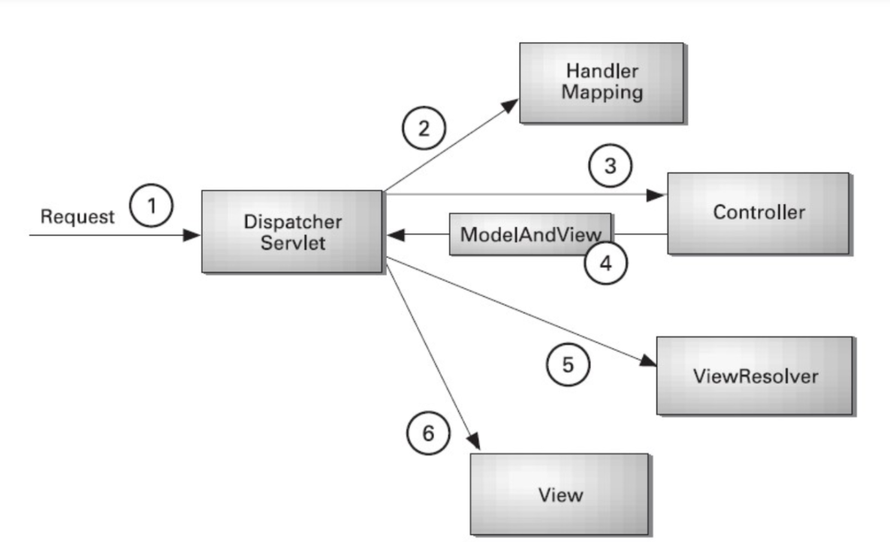

# Spring MVC 요청 처리 흐름
## MVC 프레임워크 구조

- **DispatchServlet** :	유일한 서블릿 클래스로서 모든 클라이언트의 요청을 가장 먼저 처리하는 **FrontController**
- **HandlerMapping** : 클라이언트의 요청을 처리할 Controller 매핑
- **Controller** : 실질적인 클라이언트의 요청 처리
- **ViewResolver** : Controller가 리턴한 View 이름으로 실행될 JSP 경로완성

## 컨트롤러 호출하기
### HandlerMapping
- Handler들에 대한 매핑정보를 갖고 있는 객체
- 요청에 맞는 Handler를 찾아 반환시켜준다.

### HandlerAdapter
- HandlerMapping에서 받아온 Handler를 처리해주는 객체

### 참고
- https://stonehee99.tistory.com/24
- https://jaehee1007.tistory.com/3
- https://mangkyu.tistory.com/18